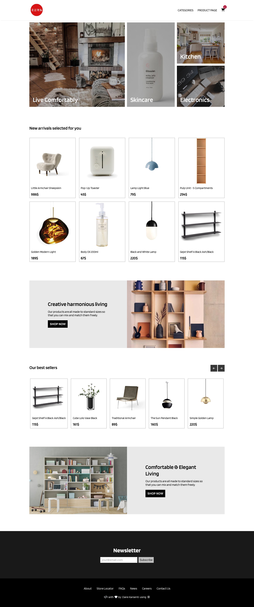
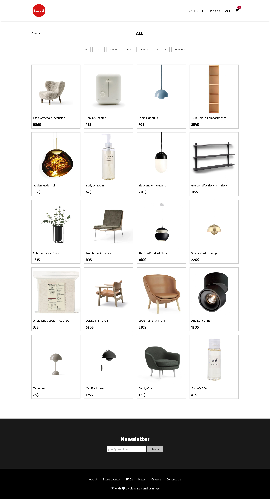
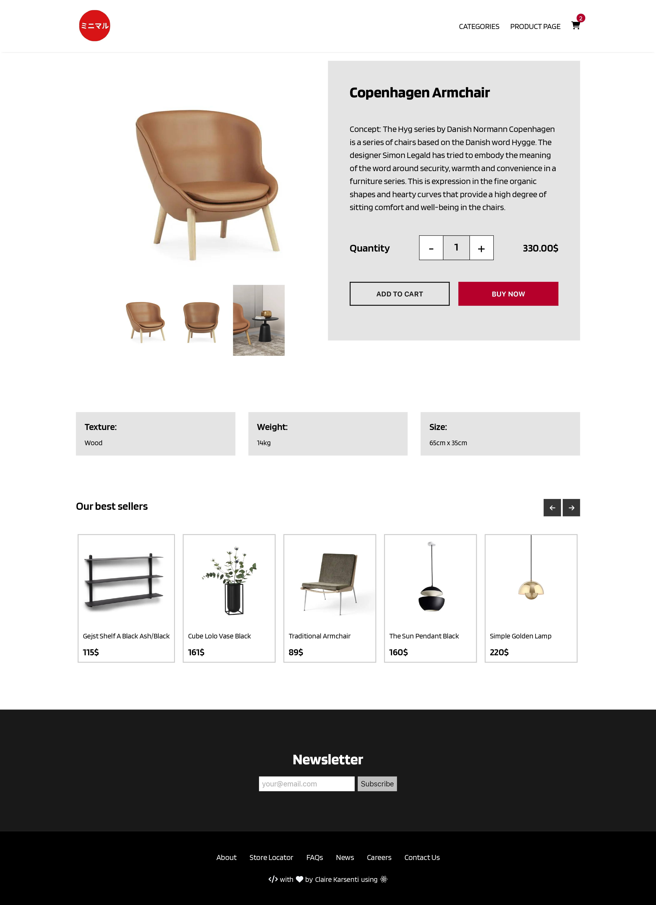
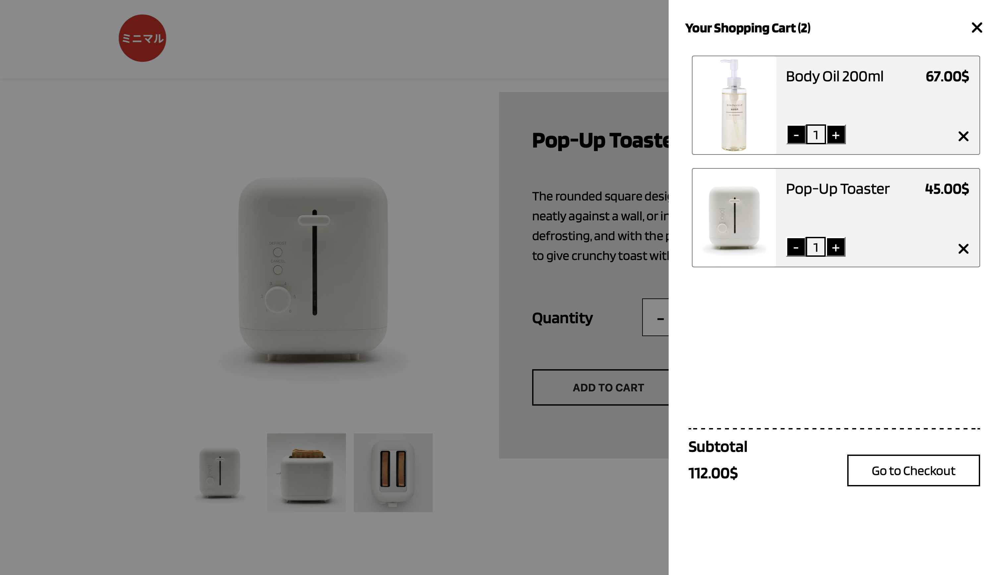

# Lifestyle eshop

- [Lifestyle eshop](#lifestyle-eshop)
  - [About the project](#about-the-project)
    - [Stack](#stack)
    - [Link](#link)
  - [Screenshots of the Project](#screenshots-of-the-project)
    - [Home Page](#home-page)
    - [Categories Page](#categories-page)
    - [Product Page](#product-page)
    - [Shopping Cart](#shopping-cart)

## About the project
This website is an example of a minimalist online store site built using React and CSS. It features a contemporary and user-friendly layout, incorporating simple navigation and a simple shopping process that draws attention to the products themselves.

### Stack
- React JS
- CSS
- HTML
- Cypress

### Link

[Lifestyle eshop demo](https://lifestyle-ecommerce-clairekarsenti.vercel.app/)

## Screenshots of the Project

### Home Page

### Categories Page

### Product Page

### Shopping Cart

